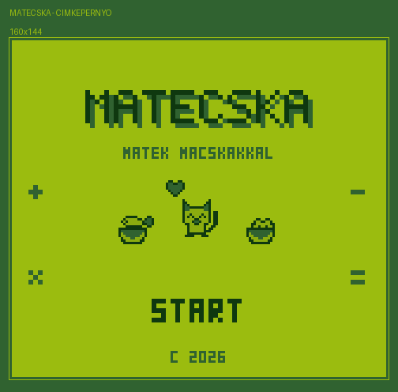

# MATECSKA

Game Boy (DMG) fejszamolos jatek. Random matekfeladat, harom valasz, es egy
macska, aki a valasztott talbol eszik - ha jol tippeltel, orul, ha nem,
fanyalog.



## Allapot

Latvanyterv es sprite-ok keszen, a feladatgenerator mukodik es tesztelt.
A GB-oldali megjelenites vazlat szinten van meg.

| resz | allapot |
|---|---|
| sprite-ok + animaciok | kesz (`src/sprites.h`) |
| latvanyterv | kesz (`design/`) |
| feladatgenerator | kesz, tesztelt (`make test`) |
| allapotgep vaz | kesz (`src/main.c`) |
| font tile-ok, szovegkiiras | hianyzik |
| hattergrafika, HUD | hianyzik |
| hang | hianyzik |

## Gyorsindulas

```sh
export GBDK_HOME=$HOME/gbdk
make test     # feladatgenerator gcc-vel, GBDK nelkul is megy
make          # build/matecska.gb
make run      # emulatorban
```

## Mappak

```
src/      C forras (sprites.h GENERALT - ne szerkeszd kezzel)
assets/   1x sprite sheet PNG (Aseprite / png2asset bemenet)
design/   latvanytervek: cimkepernyo, jatekmenet, animaciok, karakterlap
tools/    Python sprite- es latvanyterv-generatorok
```

Reszletes brief: **[CLAUDE.md](CLAUDE.md)**
